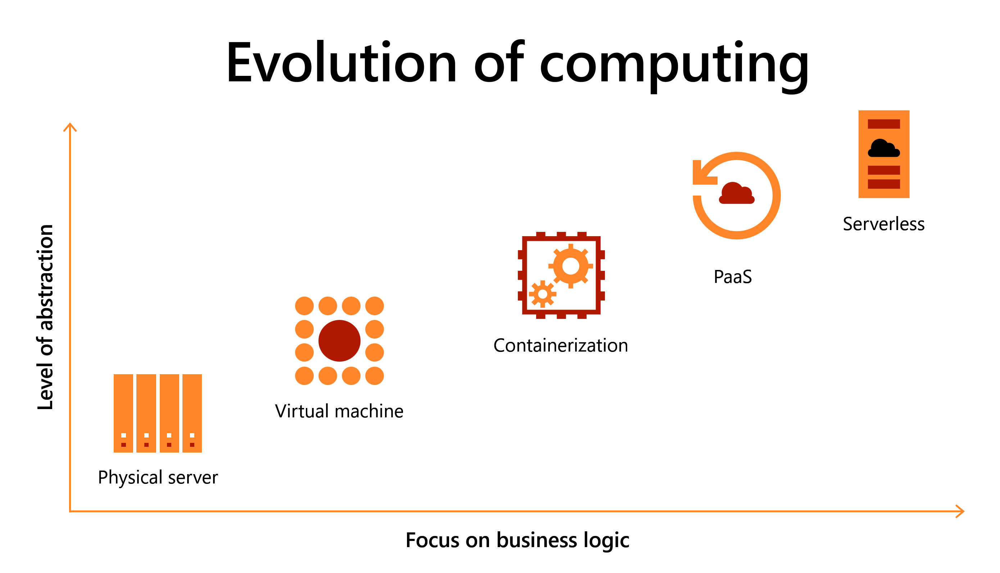

# History

In the early days of Azure (circa 2008) the only compute option was PaaS (Platform as a Service) in the form of Web Roles and Worker Roles.

It was often a challenge to get software running in this environment, but the effort
often was often rewarded with a system that was stateless, scalable, it might have used the native queues and blobs, and was probably connected into the health monitoring and events raised by the cloud fabric. The apps were modernised and cloud-native.

When general purpose Virtual Machines (IaaS) were later made available, many kinds of workloads that were previously hard or impossible
to deploy as PaaS could then be deployed to the cloud. This started a 'lift and shift' mindset, whereby entire data centres could just
be duplicated in a cloud environment.

This made cloud migration easy, quick and low risk.

However, in the meantime, a couple of major advances were made to PaaS.

1. Containerisation and the rise of Kubernetes meant you could run your own PaaS on IaaS and move between clouds or support hybrid deployments.
1. Serverless computing took off with a pricing structure where you only pay for the compute resources you need, without having to think about scaling. It was an extreme PaaS.

We are now emerging to a new dawn of application modernisation. Microsoft is investing, customers want to modernise applications, and there are some exciting new options. There is also some interesting stuff on the horizon.

# Why Modernise?

What advantages do PaaS services have over Iaas?

__Cost Efficiency.__ PaaS services are generally more elastic than IaaS, making it easier to both scale
up during period of high demand, but also scale down during quieter times. Serverless applications can often scale down to zero. We don't want to pay for computers that are idle. We don't want to consume unnecessary energy either.

__Improved User Experience.__ The ability to rapidly scale horizontally results in a better experience for the end customer. If we can scale to meet traffic demands, we don't see so many cases where system performance degrades due to high demand. 

__Operational Efficiency.__ PaaS services provide a higher level of abstraction than IaaS. Taking away the burden and technical debt of maintaining the operating system and installing your software, PaaS service allow you to just bring your code, and ultimately focus on adding business value than server administration.

__Security.__ With the patching of the underlying compute infrastructure happening automatically, this attack vector is minimised. 

__Agility.__ A PaaS Service allows you to deploy software rapidly, reducing the time between commit and production. This allows developer to respond to new requirements, changes in the market, or fix bugs quickly. We can stand new environments up quickly to provide test infrastructure, or launch new services purely by pushing code.

# Which Hosting Platform?

In contrast to the constraints in the early days of Azure, which started out with just one application hosting platform, there are now many options available. Picking the right one is often a confusing decision.

Whilst a [decision tree](https://learn.microsoft.com/en-us/azure/architecture/guide/technology-choices/compute-decision-tree) is available to guide you through this choice, I prefer to think in more simple terms.

This graph illustrates the balance between control and responsibility. On the left hand side you have total control, but also a high level of repsponsibility. This translates to a high operation cost. The further right you go, the more you take advantage of the automation and management offered by the cloud, thus reducing you operational burden. However, not all workloads are able to to be hosted in a serverless environment, so the strategy should be to move as far right as possible, and work to shift right over time.

# How to Modernise?

Modernisation is a journey. It's the continuous acknowledgement that technical debt should be paid down, and that we should be constantly looking for ways to improve our software, and opportunities to make the team more efficient. This could include refactoring, rearchitecting, or rewriting, but it could also include improving the way we work, or the tools we use.

It may mean breaking up a monolith, and slowly migrating components to PaaS services. It may mean rewriting a component from scratch, or it may mean just moving the code to a new environment.

I would suggest that the first step is to understand the current state of the application. This could be done by a combination of code analysis, and interviews with the development team. Then form a prioritised list of improvements that can be made, focusing on delivering business value, and reducing the greatest parts of technical debt.

# Modernising the Team

Often with modernisation programmes focus is given to the software, but the structure, processes and culture of the team is often overlooked. Modernising the team is just as important as modernising the software. Given that one of the greatest advantages to modernising is increased agility, if you don't have a team that's geared to releasing software frequently, you won't be able to take advantage of this.

We're also seeing productivity shifts, with tools like GitHub Copilot accelerating programming. DevOps is now DevSecOps, and we're seeing fusion teams being assembled, using telemetry and data collected from users to drive business decisions using the scientific method (AIOps).

Microsoft's own journey is documented in the [DevOps Dojo blog series](https://devblogs.microsoft.com/devops/intro-of-devops-dojo/).

# Future PaaS

We're seeing some interesting developments in the PaaS services now on offer.

__Edge Computing.__ With services such as Azure Arc, we can run PaaS services on hybrid or multi-cloud scenarios. This allows us to provide developers with many of the advantages of PaaS, and a unified monitoring and management plane for workloads that must remain on-prem or close to the edge.

__WASM.__ Web Assembly is a runtime which runs compiled code in the browser. The browser as an application hosting environment (despite being notoriously inconsistent in the early years) has become a very consistent. This has allowed application code to be completely agnostic to the underlying operating system or device, using a consistent set of APIs to support common operations such as reading the GPS or connecting to the camera. WASM in the cloud allows developers the same experience, being able to build cloud-native applications regardless of the underlying hosting providers, and access to common services such as storage, logging, monitoring and telemetry without the need for vendor-specific SDKs.

__Confidential Computing.__ 

Confidential computing technology isolates sensitive data in a protected CPU enclave during processing. The contents of the enclave—the data being processed, and the techniques that are used to process it—are accessible only to authorized programming code, and are invisible and unknowable to anything or anyone else, including the cloud provider. The primary goal of confidential computing is to provide greater assurance that data in the cloud is protected and private.

__Low Code / No Code.__

Low-code or no-code platforms such as the Power Platform are transforming app and software development by drawing in new users with a low barrier to entry and shallow learning curve. Professional developers as well as "citizen" or non-professional developers can use a low-code approach to quickly and easily create apps of varying complexity. Low-code solutions can also reduce the cost and time typically required for software development, making low-code development a desirable option for businesses that are looking to meet modern demands with automation and accelerate digital transformation.

